# Data Flow Diagram

```mermaid
flowchart LR
    A[Raw CSV/TXT<br/>Minute-level data] --> B[Ingestion<br/>PySpark read]
    B --> C{HDFS Available?}
    C -->|Yes| D[HDFS Raw Storage]
    C -->|No| E[Local Raw Storage]
    D --> F[PySpark Preprocessing]
    E --> F
    F --> G[Timestamp Parsing]
    G --> H[Missing Value Handling]
    H --> I[Duplicate Removal]
    I --> J[Hourly Aggregation<br/>sum kW / 60 = kWh]
    J --> K[Parquet Storage]
    K --> L[Feature Engineering<br/>Lags + Time Features]
    L --> M[Chronological Split<br/>70/15/15]
    M --> N[Model Training]
    N --> O[Validation Metrics]
    O --> P[Best Model Selection]
    P --> Q[Test Evaluation]
    Q --> R[24-Hour Recursive Forecast]
    R --> S[Dashboard Visualization]
```

## Data Formats

| Stage | Format | Location |
|-------|--------|----------|
| Raw | Semicolon-delimited TXT | `data/raw/` or HDFS `/energy_forecasting/raw/` |
| Hourly | Parquet | `data/processed/hourly/` |
| Features | Parquet | `data/processed/features/` |
| Models | Spark ML format | `models/` |
| Metrics | JSON/CSV | `results/metrics/` |
| Predictions | CSV | `results/predictions/` |

## Why Parquet?

Parquet is a columnar storage format that provides:
- Efficient compression (smaller files)
- Schema preservation (types embedded)
- Fast column pruning for analytics
- Native Spark integration
