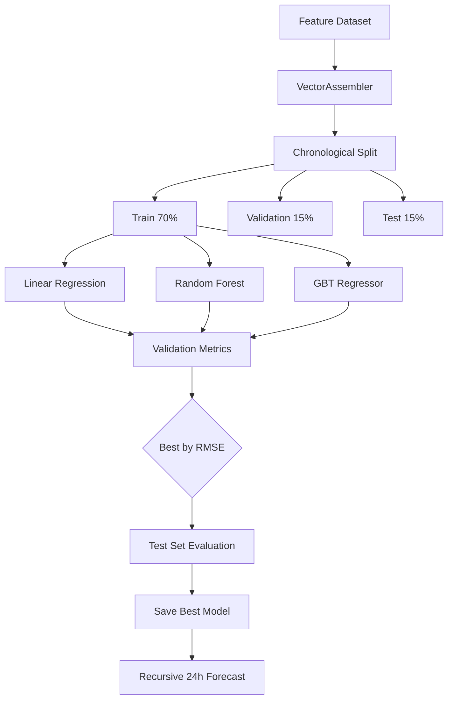

# ML Pipeline

## Models

### Linear Regression
- **Algorithm**: Ordinary least squares with L2 regularization
- **Features**: 11 time-series features
- **Target**: hourly_energy_consumption (kWh)
- **Hyperparameters**: maxIter=100, regParam=0.1

### Random Forest
- **Algorithm**: Ensemble of decision trees
- **Features**: Same 11 features
- **Hyperparameters**: numTrees=50, maxDepth=10

### Gradient Boosting (Optional)
- **Algorithm**: Sequential tree boosting
- **Hyperparameters**: maxIter=50, maxDepth=5

## Evaluation Metrics

| Metric | Formula | Notes |
|--------|---------|-------|
| MAE | mean(\|actual - predicted\|) | Easy to interpret in kWh |
| RMSE | sqrt(mean((actual - predicted)²)) | Penalizes large errors |
| MAPE | mean(\|actual - predicted\| / actual) × 100 | Masked for near-zero values |
| R² | 1 - SS_res/SS_tot | Proportion of variance explained |

## Time-Series Split Rationale

Random shuffling is inappropriate because:
1. It causes **data leakage** (future data in training)
2. It breaks temporal dependencies needed for lag features
3. It produces optimistically biased metrics

Chronological splitting preserves temporal order and simulates real deployment.
