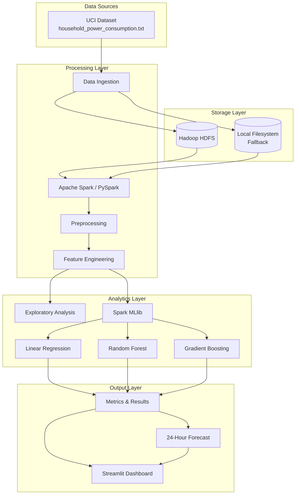

# System Architecture

## Overview

The Energy Consumption Forecasting system follows a layered Big Data architecture designed for scalability and reproducibility.

## Architecture Diagram

## Component Descriptions

| Component | Technology | Purpose |
|-----------|-----------|---------|
| Raw Storage | HDFS / Local | Store original and processed datasets |
| Processing | PySpark | Distributed data cleaning and transformation |
| ML Training | Spark MLlib | Train regression models at scale |
| Results | JSON/CSV/Parquet | Persist metrics, predictions, models |
| Visualization | Streamlit + Plotly | Interactive dashboard |

## Scalability Note

The prototype uses a publicly available dataset (~2M records) that fits on a single machine. The architecture demonstrates how the same pipeline extends to smart-meter datasets with billions of records by scaling HDFS storage and Spark executors.
