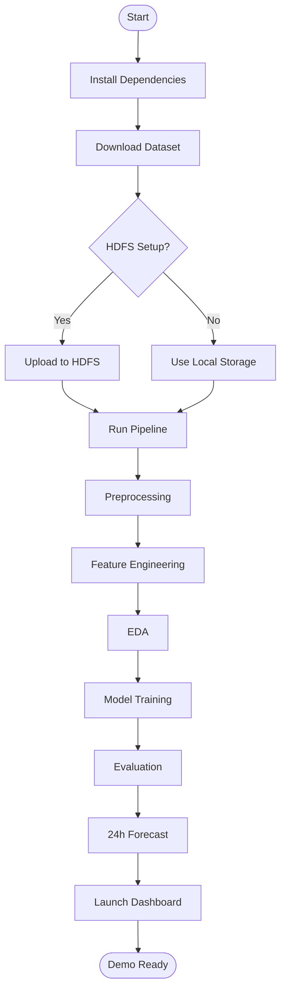

# Project Workflow



## Execution Commands

```bash
# 1. Setup
python -m venv venv
venv\Scripts\activate        # Windows
pip install -r requirements.txt

# 2. Download data
python scripts/download_dataset.py

# 3. Run pipeline (local mode)
python scripts/run_pipeline.py

# 4. Launch dashboard
streamlit run dashboard/app.py
```
